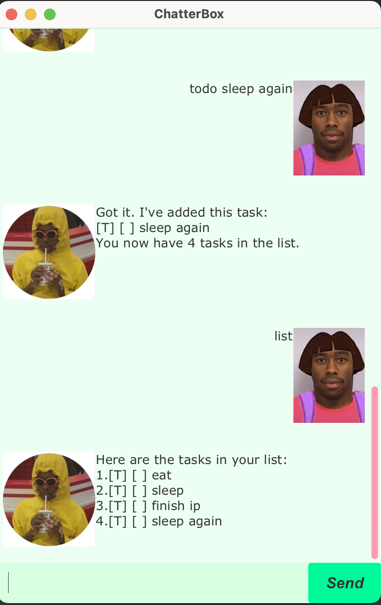

# ChatterBox User Guide


Welcome! ChatterBox is your friendly, easy-to-use graphical user interface (GUI) that helps you track all the tasks that you need. No more forgetting what tasks you have!

All that you need to do is:
- Download the latest release
- Navigate to the folder where your download is located within your terminal
- Run `java -jar chatterbox.jar` and you are ready to use it!

### Features & Commands
Some features include:
- Addition / Deletion of Tasks (including Todo, Deadlines & Event tasks)
- Marking tasks as done
- Unmarking tasks as incomplete
- Finding tasks based on keywords
- Saves your tasks so you don't have to keep the application running!

**Adding a Todo Task:** `todo` command

Adds a Todo task into your task list.

Format: `todo <description>`
Example: `todo meetup with friends`

You will receive a reply stating that the todo task has been added.
```
Expected Output:

Got it. I've added this task:
[T] [ ] meetup with friends
You now have 1 tasks in the list.
```

**Adding a Deadline Task:** `deadline` command

Adds a Deadline task into your task list.

Format: `deadline <description> /by <time>`
- NOTE: that `<time>` should be in the format `dd-mm-yyyy HH:mm`
Example: `deadline project submission /by 01-08-2025 16:00`

You will receive a reply stating that the deadline task has been added.
```
Expected Output:

Got it. I've added this task:
[D] [ ] project submission (by: Aug 1 2025 16:00)
You now have 2 tasks in the list.
```

**Adding a Event Task:** `event` command

Adds a Event task into your task list.

Format: `event <description> /from <start_time> /to <end_time>`
Example: `event dinner event /from Sunday 7pm /to Sunday 9pm`

You will receive a reply stating that the event task has been added.
```
Expected Output:

Got it. I've added this task:
[E] [ ] dinner event (from: Sunday 7pm to: Sunday 9pm)
You now have 3 tasks in the list.
```

**Listing your tasks:** `list` command

Lists all the tasks you have added to your list.

Format: `list`

You will receive a list of all the tasks in your list currently.
```
Expected Output:

Here are the tasks in your list:
1.[T] [ ] meetup with friends
2.[D] [ ] project submission (by: Aug 1 2025 16:00)
3.[E] [ ] dinner event (from: Sunday 7pm to: Sunday 9pm)
```

**Deleting a task:** `delete` command

Deletes a task from your current list.

Format: `delete <index>`
- Deletes the task at the specified index. The index refers to the index number shown when calling `list`. The index should be a positive number from 1.
Example: `delete 2`
```
Expected Output:

Noted. I've removed this task:
[D] [ ] project submission (by: Aug 1 2025 16:00)
Now you have 2 tasks in the list.
```

Finding a specific task: `find` command

Finds a task whose description contains the keyword specified.

Format: `find <keyword>`
- NOTE: The search is case sensitive and only the description is searched
Example: `find meet`
```
Expected Output:

Here are the matching tasks in your list:
1.[T] [ ] meetup with friends
```

Marking a task as done: `mark` command

Marks an existing task as completed

Format: `mark <index>`
- Marks the task at the specified index. The index refers to the index number shown when calling `list`. The index should be a positive number from 1.
Example: `mark 1`
```
Expected Output:

Nice! I've marked this task as done:
[T] [X] meetup with friends
```

Unmarking a task as done: `unmark` command

Unmarks an existing task as incomplete

Format: `unmark <index>`
- Unmarks the task at the specified index. The index refers to the index number shown when calling `list`. The index should be a positive number from 1.
Example: `unmark 1`
```
Expected Output:

OK, I've marked this task as not done yet:
[T] [ ] meetup with friends
```

Exiting the application: `bye` command

Exits the program and saves the current state of the list.

Format: `bye`
- Application will close automatically after 2 seconds.